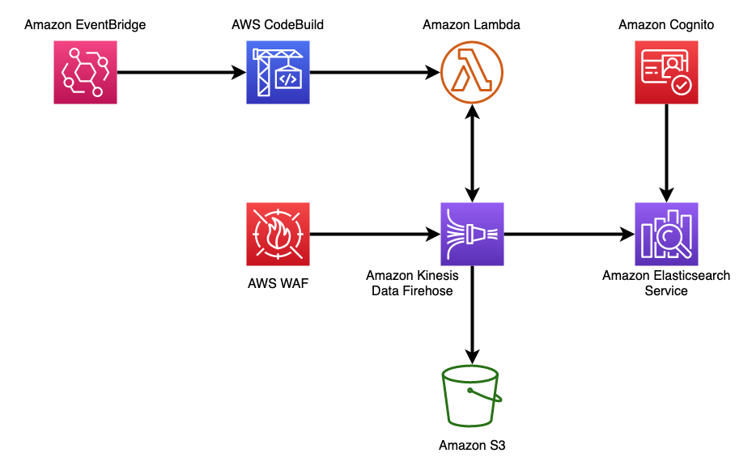
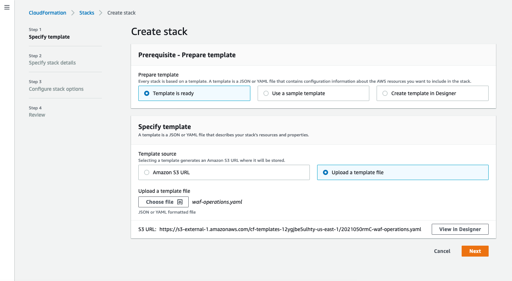
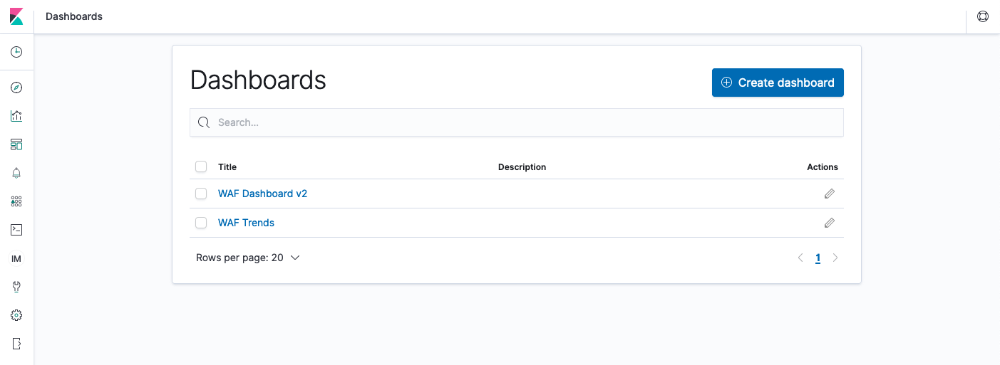
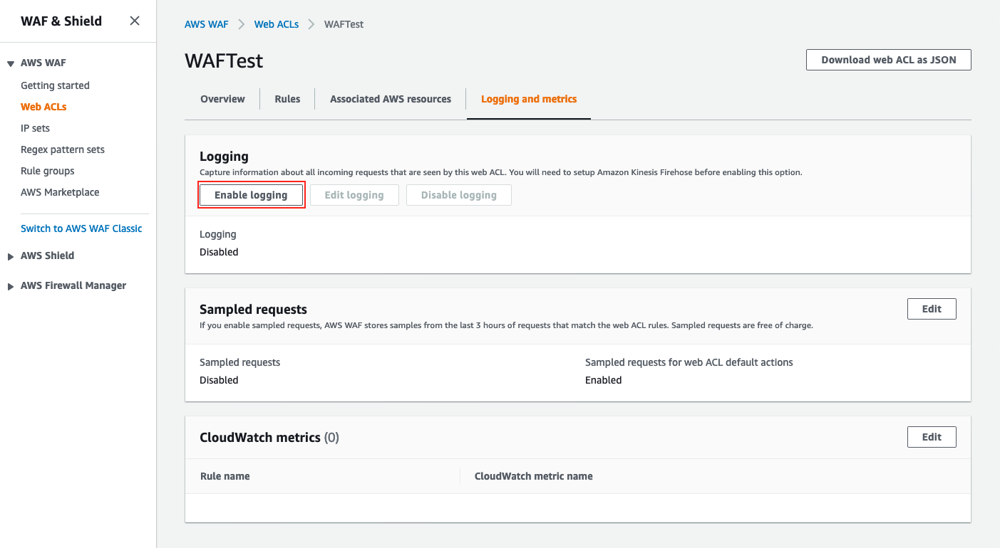
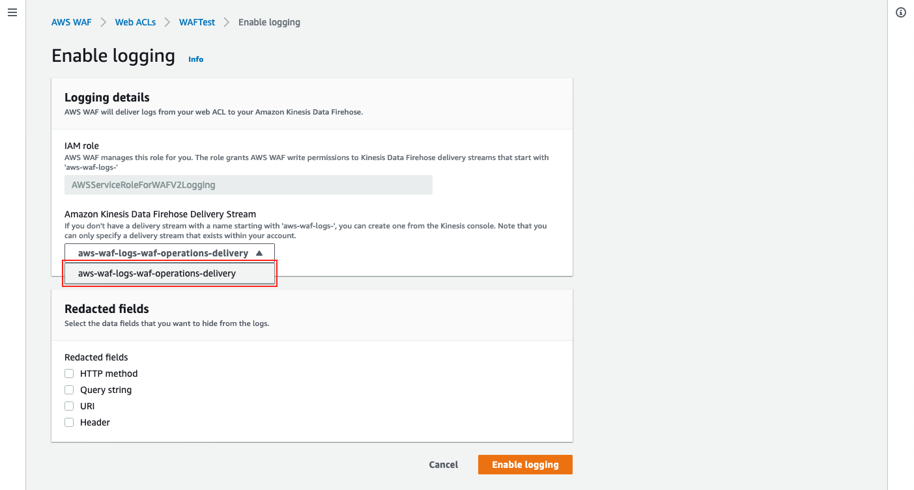

# AWS WAF Operations Dashboards

[View this page in Portuguese](README_pt.md)

#### Build multi-account dashboards on Elasticsearch for AWS Web Application Firewall operation and log investigation

In this repository, we share code for building infrastructure to collect, enrich, and visualize AWS Web Application Firewall logs. Implementing this project in your AWS account will allow you to view and filter the logs through Kibana dashboards below, as well as customize views and dashboards to your needs.


### AWS Services Used

Following the steps below, you will create an infrastructure in your AWS account as per the diagram below, using the following AWS services:
* Amazon Kinesis Data Firehose
* Amazon Cognito
* Amazon Elasticsearch Service
* Amazon S3
* Amazon EventBridge
* AWS CodeBuild
* AWS Lambda



### Installation

To do the installation, we will first need to build an AWS Lambda function, and for this we will use the AWS CloudShell. You can open CloudShell by clicking on its icon in the top bar of the AWS Console, as shown below.


When CloudShell opens, we will run the following commands, replacing the value &lt;bucket_name&gt; with a unique bucket name that you choose:

```
aws s3 mb s3://<bucket_name>
wget https://aws-waf-operations.s3.amazonaws.com/create_esconfig.sh
chmod +x create_esconfig.sh
./create_esconfig.sh <bucket_name>
```


After running the above commands in CloudShell, copy the `waf-operations.yaml` file from this repository to a local folder. Then open the AWS console in the *CloudFormation* service, click *Create Stack*, select *With new resources (standard)*, then in the *Template source* section select *Upload a template file*, click *Choose file* and choose the file you copied to your local folder. Finally click *Next*:



In the next screen, set a name for the stack and fill in the required parameters. The ESConfigBucket parameter is the name you chose for the bucket created with CloudShell and YourEmail is the email address at which you will receive the temporary credentials for authentication to Amazon Cognito. Then click *Next*, and again *Next*.


On the last screen, authorize CloudFormation to create IAM resources, and click *Create stack*:


The next step should take 30-40 minutes:


During the process, you should receive an email with temporary credentials:


When the deployment process is complete, we can access the Kibana dashboard via its URL. If you need to use ElasticSearch directly, its URL is also available. You can find it in the Outputs tab of AWS CloudFormation:


The Cognito screen will be displayed. Use the credentials sent to you by email:





When you open the dashboards, you will notice that they are missing data. To get the data to start populating, go to the AWS WAF console, and activate the logs by directing them to the Kinesis Data Firehose created through this project. Once the requests start coming in and being processed you can do a *Refresh* of the data and start your work of visualizing, analyzing and investigating the requests to your applications protected by AWS WAF:





And these are the dashboards with data:


### Uninstalling

To remove the solution, disable AWS WAF logging to be sent to this solution, wait some minutes for the last logs to be processed and delete the stack via the AWS CloudFormation console.
WARNING: When deleted, the logs backup stored on the S3 bucket created by the solution will be deleted along with the bucket.
